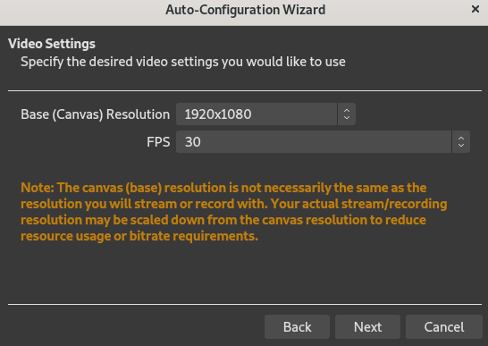
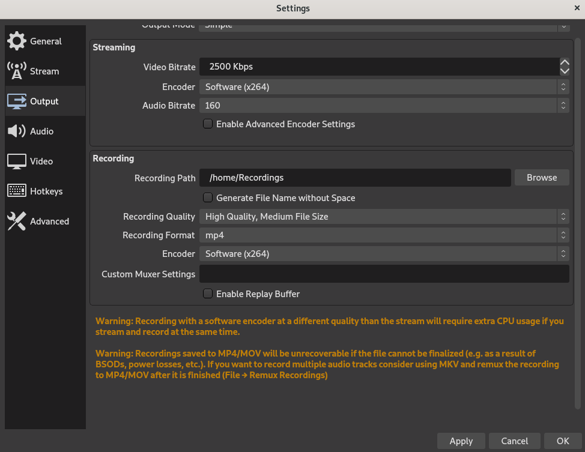

# How to record material for virtual presentaions

## Setup

1. Download the installer for your system and install OBS Studio: [OBS Installation Instructions](https://obsproject.com/wiki/install-instructions)
2. Open OBS Studio and run through the _AutoConfig Wizard_
    1. Select `Optimize for recording` as the focus is on recording our screen.
    2. Select `1920x1080` for the Base Resolution, and `30` for the FPS.
    .
    3. Once it is done testing, click on `Apply Settings`.
3. Next, we will be configuring the OSB settings. Start by click on `Settings`
    1. Click on `Output`
        - Select an output path.
        - Select `mp4` as the Recording Format
        - Select `x264` for the Encoder
        - The bitrate is a fine balance between video size and quality. Generally the default of 2500 Kbps is enough for most demos. If your recording requires a higher resolution/framerate the  Youtube's [Recommended upload encoding settings](https://support.google.com/youtube/answer/1722171) provide a good guide.
        
    2. Click on `Audio`
        - Select your microphone under the `Mic/Auxiliary Audio` setting
        - It's generally preferred to use a mic that is _not_ your laptop's inbuilt microphone. Though convenient, the audio quality will be worse than using a USB microphone.
        - While OBS allows you to record both audio and your screen at the same time, we'd recommend recording your screen and vocalizing your demo separately, and overlaying them. This is much simpler than trying to do both at the same time.
    3. Click on `Video`
        - Set the `Base resolution` to 1920x1080
        - Set the `Output resolution` to 1920x1080
        - Set the `FPS` to 30
    4. Note: You can also setup hotkeys via the `Hotkeys` tab to start/stop recordings if you find using the keyboard simpler.
4. Scene and Source Setup
    1. Add the `Screen Capture` Source by clicking the + in the Sources box
    2. Pick the screen you are looking to capture (if you have additional monitors)
        - Right click on the live screen capture with OBS and choose Transform -> Center. Then, right click on the capture and choose Transform -> Fit to Screen
        - Note: Wayland users may run into an issue with OBS showing a black screen. Switching to Xorg is a quick fix for the issue.
    3. Add your webcam to the bottom corner if you want.
        - To do so, you can just click on the `+` and adding a video capture device. Resize as desired.
    4. OBS Studio makes it easy to switch between scenes. If you would like to record a different ‘thing’ for your recording you might want to add scenes and flip through them while recording live.
